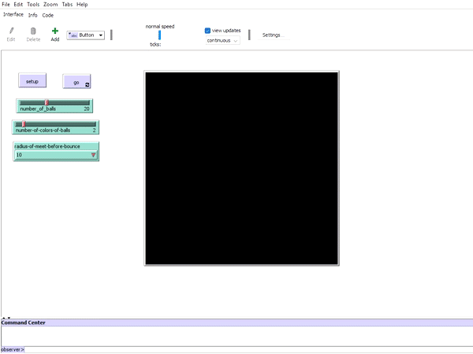

# Agent Based Modeling task for Bouncing Network
 

### Task

Model a bouncing network of colored agents that bounces of the boundaries of the environment, obstacles and when bumped into each other. It is modeled using NetLogo.

### Requirements:

* NetLogo (Install from here : https://ccl.northwestern.edu/netlogo/download.shtml)

### Hyperparameters:

* Number of Agents
* Agents color
* Radius of Meeting of Agents to bounce off
* Speed of motion